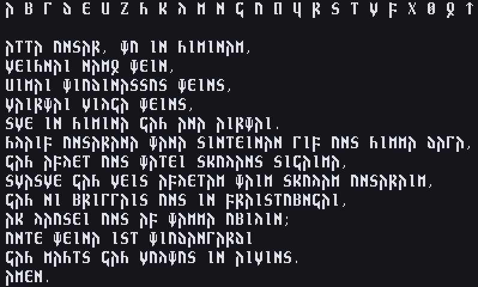

# Gothic Bitmap Mono

A bitmap monospace font for Gothic language and its alphabet.

As of now the only supported size is `8x14` 

The `.otb` version is the original bitmap font.
The `.otf` version is vectorized, meaning that it can be scaled to any size.

## How to build the `.otf` and `.otb` files
Requirements:
 - `aseprite`
 - `potrace`
 - `imagemagick`
 - `fontforge`

run `./build.sh`

Then use `./install.sh` to install the fonts, they will be copied to 
`~/.local/share/fonts`
